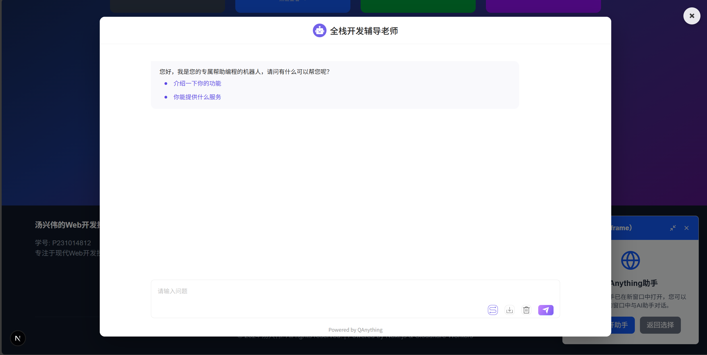
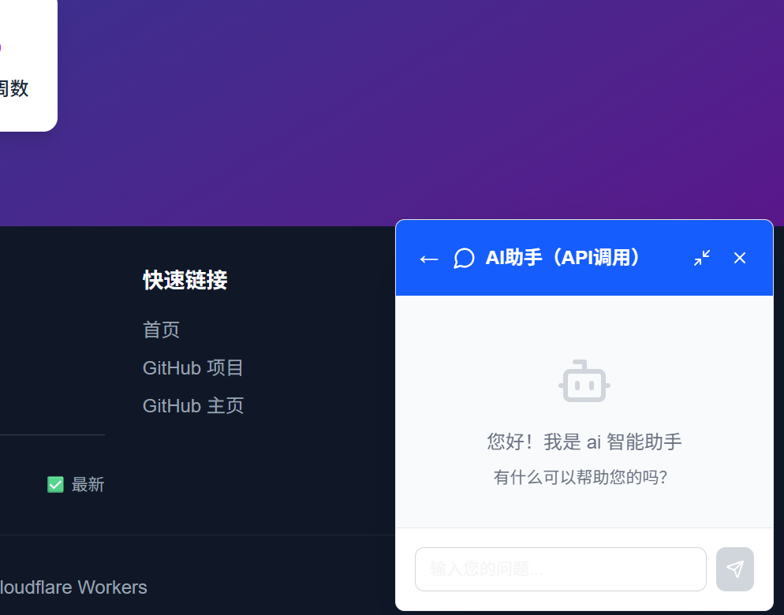
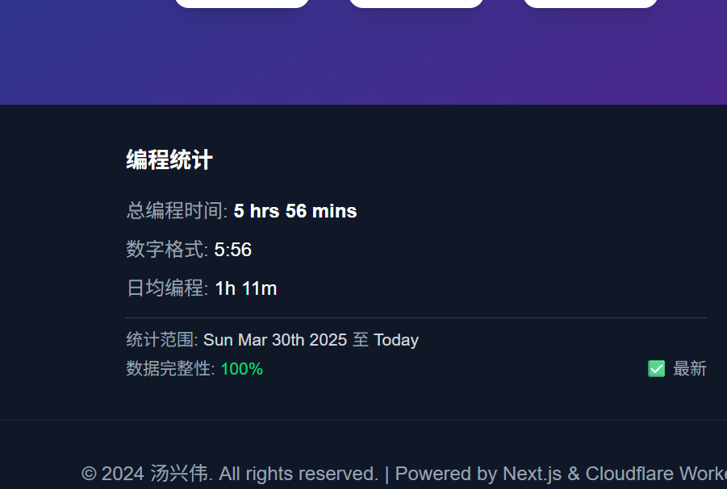
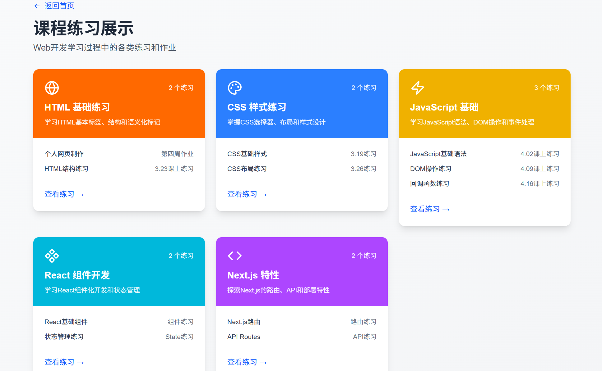
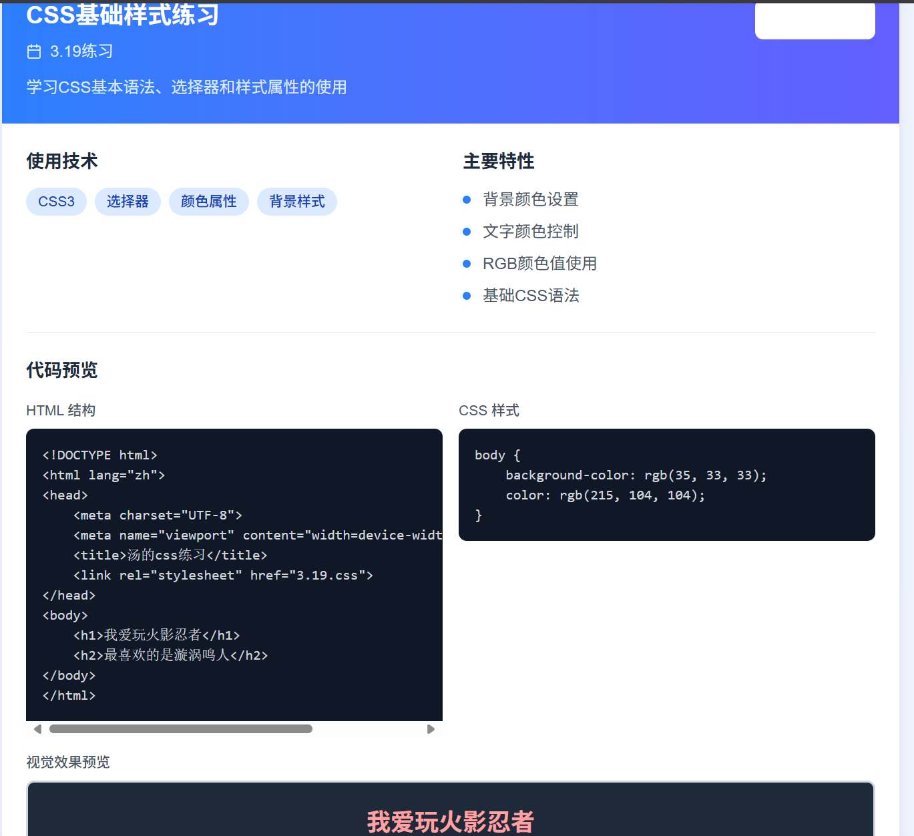

# 汤兴伟的Web开发探索之旅

**创作者**: 汤兴伟  
**学号**: P231014812  
**项目**: 期末综合作业 - Next.js Web应用开发

## 项目简介

本项目是一个基于 Next.js 框架构建的综合性 Web 应用，整合了本学期学习的 HTML、CSS、JavaScript、React 以及 Next.js 等技术。项目主要功能包括：

- 📊 **WakaTime API 集成**: 实时展示个人编程时长统计，通过页脚展示编程数据
- 🤖 **AI 助手服务**: 集成 QAnything 大语言模型问答服务和 DeepSeek API，提供双模式AI体验
- 📁 **课程练习展示**: 整合本学期全部课程练习，包括HTML、CSS、JavaScript、React等分类展示
- 🎨 **现代化 UI**: 使用 Tailwind CSS 构建响应式界面，支持深色主题和渐变背景
- 🔗 **GitHub 项目展示**: 动态获取并展示 GitHub 仓库项目
- 🎯 **交互优化**: 为可点击元素添加视觉提示，提升用户体验

## QAnything 集成路径与实现细节

### 选择路径：基础路径 + 进阶路径混合实现

本项目采用了**混合实现方案**，为用户提供两种 AI 助手体验：

#### 1. 基础路径 - QAnything iframe 集成
- **实现方式**: 通过 iframe 直接嵌入 QAnything 提供的 HTML 问答页面
- **技术特点**: 
  - 点击"AI助手（iframe）"按钮后，动态创建全屏 iframe 弹窗
  - 支持多种关闭方式：关闭按钮、背景点击、ESC 键
  - 响应式设计，适配不同屏幕尺寸
- **URL**: `https://qanything.ai/chat/030447765EC44191`

#### 2. 进阶路径 - DeepSeek API 自主开发
- **实现方式**: 自行调用 DeepSeek API 接口，独立开发前端交互界面
- **技术特点**:
  - 完整的聊天界面，支持实时对话
  - 流式输出显示，提升用户体验
  - 完善的错误处理和加载状态管理
  - API Key 安全管理（通过环境变量）

#### 3. 悬浮窗设计
- **位置**: 页面右下角固定悬浮按钮
- **交互**: 点击后弹出选择界面，用户可选择不同的 AI 助手模式
- **状态管理**: 使用 React Hooks 管理聊天状态和模式切换

### 选择原因

选择混合实现方案的原因：
1. **用户体验多样化**: 为不同需求的用户提供不同的交互体验
2. **技术能力展示**: 既展示了 iframe 集成的简洁性，又体现了 API 调用的技术深度
3. **风险控制**: 确保至少有一种方式能够稳定工作
4. **学习价值**: 通过对比两种实现方式，加深对不同集成方案的理解

## WakaTime API 集成方法

### 架构设计

```
网站页脚 → Cloudflare Worker → WakaTime API → 统计数据显示
```

### 实现步骤

#### 1. Cloudflare Worker 部署
- **文件位置**: `cloudflare-worker/wakatime-worker.js`
- **功能**: 作为代理服务器，解决 CORS 问题并保护 API Key
- **部署地址**: `https://tight-hill-8c38.3420808767.workers.dev`

#### 2. 环境变量配置
- **变量名**: `WAKATIME_API_KEY`
- **存储位置**: Cloudflare Worker 环境变量
- **安全性**: API Key 不会暴露给客户端

#### 3. 前端集成
- **组件位置**: `app/components/Footer.tsx`
- **显示内容**:
  - 总编程时间
  - 数字格式时间
  - 日均编程时间
  - 统计范围和数据完整性
  - 主要编程语言占比（前3种）

#### 4. 缓存策略
- **缓存时间**: 1小时
- **优势**: 减少 API 调用频率，提高页面加载速度

### API 安全管理

1. **API Key 隔离**: 通过 Cloudflare Worker 环境变量存储
2. **CORS 处理**: Worker 自动处理跨域请求
3. **错误处理**: 完善的错误捕获和用户友好的错误提示
4. **HTTPS 传输**: 确保数据传输安全

## Next.js 项目结构

```
qimozuoye/
├── app/                          # App Router 目录
│   ├── api/                      # API 路由
│   │   ├── chat/                 # DeepSeek 聊天 API
│   │   ├── projects/             # GitHub 项目 API
│   │   ├── qanything/            # QAnything 代理 API
│   │   └── wakatime/             # WakaTime 统计 API
│   ├── components/               # 可复用组件
│   │   ├── FloatingChat.tsx      # 悬浮聊天组件
│   │   ├── Footer.tsx            # 页脚组件（WakaTime集成）
│   │   ├── LoadingSpinner.js     # 加载动画组件
│   │   └── ProjectCard.js        # 项目卡片组件
│   ├── exercises/                # 课程练习目录
│   │   ├── css-styling/          # CSS 样式练习
│   │   ├── html-basics/          # HTML 基础练习
│   │   ├── javascript-fundamentals/ # JavaScript 基础练习
│   │   ├── nextjs-features/      # Next.js 特性练习
│   │   └── react-components/     # React 组件练习
│   ├── github-projects/          # GitHub 项目展示页
│   ├── projects/                 # 项目详情页
│   ├── wakatime-stats/           # WakaTime 统计页
│   ├── globals.css               # 全局样式
│   ├── layout.tsx                # 根布局组件
│   └── page.tsx                  # 首页
├── cloudflare-worker/            # Cloudflare Worker 代码
│   ├── README.md                 # Worker 部署指南
│   └── wakatime-worker.js        # WakaTime API 代理
├── lib/                          # 工具库
│   ├── deepseek.ts               # DeepSeek API 配置
│   └── github.js                 # GitHub API 配置
├── public/                       # 静态资源
├── types/                        # TypeScript 类型定义
└── docs/                         # 项目文档
```

### 核心技术特性

1. **App Router**: 使用 Next.js 13+ 的 App Router 架构
2. **TypeScript**: 全面使用 TypeScript 提供类型安全
3. **Tailwind CSS**: 使用 Tailwind CSS 构建响应式 UI
4. **API Routes**: 利用 Next.js API Routes 处理后端逻辑
5. **组件化开发**: 采用 React 组件化开发模式
6. **状态管理**: 使用 React Hooks 进行状态管理

## 课程练习整合方式

### 整合策略

本项目将本学期的所有课程练习按照技术栈分类整合到 Next.js 应用中：

#### 1. 目录结构设计
- **HTML 基础练习** (`app/exercises/html-basics/`)
- **CSS 样式练习** (`app/exercises/css-styling/`)
- **JavaScript 基础练习** (`app/exercises/javascript-fundamentals/`)
- **React 组件练习** (`app/exercises/react-components/`)
- **Next.js 特性练习** (`app/exercises/nextjs-features/`)

#### 2. 路由设计
- 每个练习类别都有独立的路由
- 支持动态路由，便于添加新练习
- 面包屑导航，方便用户浏览

#### 3. 组件化改造
- 将原有的 HTML/CSS/JS 练习改造为 React 组件
- 保持原有功能的同时，提升代码复用性
- 统一的样式风格和交互体验

#### 4. 项目展示系统
- **GitHub 集成**: 动态获取 GitHub 仓库中的项目
- **项目卡片**: 统一的项目展示卡片组件
- **详情页面**: 每个项目都有独立的详情展示页面

### 具体实现

1. **API 集成**: 通过 `/api/projects` 接口获取 GitHub 项目列表
2. **动态渲染**: 使用 Next.js 的动态路由渲染项目详情
3. **响应式设计**: 所有练习都适配移动端和桌面端
4. **加载优化**: 使用 Next.js 的图片优化和懒加载功能

## 项目运行指南

### 环境要求

- Node.js 18.0 或更高版本
- npm 或 yarn 包管理器
- Git 版本控制工具

### 安装步骤

1. **克隆项目**
   ```bash
   git clone https://github.com/Faust-10086/Web-develop.git
   cd qimozuoye
   ```

2. **安装依赖**
   ```bash
   npm install
   # 或
   yarn install
   ```

3. **环境变量配置**
   
   创建 `.env.local` 文件并配置以下环境变量：
   ```env
   # DeepSeek API 配置
   DEEPSEEK_API_KEY=your_deepseek_api_key
   DEEPSEEK_BASE_URL=https://api.deepseek.com
   
   # GitHub API 配置（可选）
   GITHUB_TOKEN=your_github_token
   ```

4. **启动开发服务器**
   ```bash
   npm run dev
   # 或
   yarn dev
   ```

5. **访问应用**
   
   打开浏览器访问 [http://localhost:3000](http://localhost:3000)

### 生产环境部署

1. **构建项目**
   ```bash
   npm run build
   ```

2. **启动生产服务器**
   ```bash
   npm run start
   ```

### WakaTime 配置（可选）

如需启用 WakaTime 统计功能：

1. 注册 [WakaTime](https://wakatime.com/) 账户
2. 获取 API Key
3. 部署 Cloudflare Worker（参考 `cloudflare-worker/README.md`）
4. 配置 Worker 环境变量

## 功能特性

### 🎯 核心功能

- **响应式设计**: 完美适配桌面端、平板和移动端
- **深色主题**: 现代化的深色主题设计，渐变背景效果
- **实时数据**: 动态获取 GitHub 项目和 WakaTime 统计
- **AI 助手**: 双模式 AI 助手（iframe + API），右下角悬浮窗设计
- **组件化架构**: 高度模块化的组件设计
- **交互提示**: 为可点击卡片添加"点击查看"提示，提升用户体验
- **统一样式**: 白色卡片配黑色文字，统一的视觉风格

### 🛠️ 技术亮点

- **TypeScript**: 全面的类型安全保障
- **Next.js 15**: 使用最新的 Next.js 特性
- **Tailwind CSS**: 原子化 CSS 框架
- **API Routes**: 服务端 API 处理
- **错误处理**: 完善的错误边界和用户反馈
- **性能优化**: 图片优化、懒加载、缓存策略

### 🔒 安全特性

- **API Key 保护**: 敏感信息通过环境变量管理
- **CORS 处理**: 通过 Cloudflare Worker 解决跨域问题
- **HTTPS 传输**: 确保数据传输安全
- **输入验证**: 前后端双重输入验证

## 项目截图

### 1. QAnything 运行截图

#### iframe 模式

*QAnything iframe 集成界面，提供完整的问答体验*

#### API 模式

*DeepSeek API 自主开发界面，支持流式对话*

### 2. WakaTime API 集成与展示截图


*页脚 WakaTime 编程统计展示，包含总时长、日均时长和主要编程语言*

### 3. Next.js 课程练习组织截图

#### 项目导航页

*GitHub 项目展示页面，动态获取仓库项目列表*

#### 具体练习运行界面

*课程练习整合展示，采用组件化开发*

## 开发日志


### 技术难点与解决方案

1. **CORS 跨域问题**
   - 问题：直接调用 WakaTime API 遇到 CORS 限制
   - 解决：使用 Cloudflare Worker 作为代理服务器

2. **API Key 安全管理**
   - 问题：前端直接使用 API Key 存在安全风险
   - 解决：通过环境变量和服务端代理保护敏感信息

3. **iframe 集成体验优化**
   - 问题：iframe 默认体验不够友好
   - 解决：自定义全屏弹窗，添加多种关闭方式

4. **组件状态管理**
   - 问题：多模式 AI 助手状态切换复杂
   - 解决：使用 React Hooks 进行统一状态管理

5. **用户体验优化**
   - 问题：用户不清楚哪些元素可以点击
   - 解决：为可点击卡片添加"点击查看"提示和悬停效果

6. **视觉一致性**
   - 问题：首页卡片样式不统一，对比度不够
   - 解决：统一采用白色背景配黑色文字，添加阴影和悬停效果

## 贡献指南

### 开发规范

1. **代码风格**: 使用 ESLint 和 Prettier 保持代码一致性
2. **提交规范**: 遵循 Conventional Commits 规范
3. **分支管理**: 使用 Git Flow 工作流
4. **测试要求**: 新功能需要添加相应测试

### 提交格式

```
type(scope): description

[optional body]

[optional footer]
```

类型说明：
- `feat`: 新功能
- `fix`: 修复 bug
- `docs`: 文档更新
- `style`: 代码格式调整
- `refactor`: 代码重构
- `test`: 测试相关
- `chore`: 构建过程或辅助工具的变动

## 许可证

本项目采用 MIT 许可证。详情请参阅 [LICENSE](LICENSE) 文件。

## 联系方式

- **作者**: 汤兴伟
- **学号**: P231014812
- **GitHub**: [Faust-10086](https://github.com/Faust-10086)
- **项目地址**: [Web-develop](https://github.com/Faust-10086/Web-develop)

---

*本项目是Web开发课程的期末综合作业，展示了现代Web开发技术的综合应用。*
